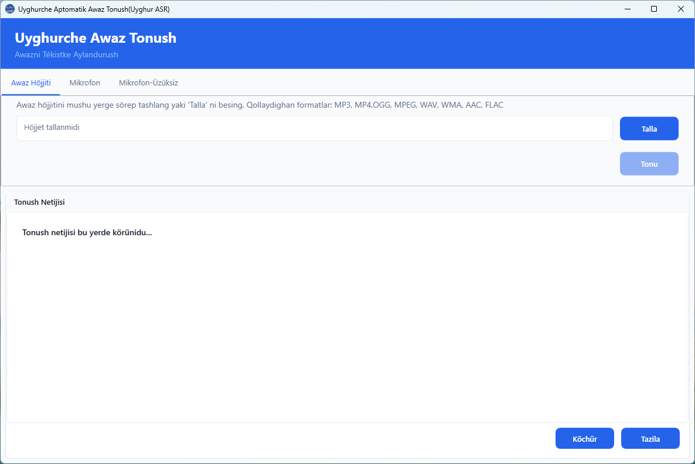

## Uyghur Automatic Speech Recognition (Uyghur ASR)

While it may not yet rival the latest LLM-powered speech recognition models, I have developed this standalone Windows application (built with C#) to provide an offline solution that is accessible even to non-technical users.
(I should mention that 90% of the application code was generated with the help of **GitHub Copilot**).

The core model was designed using **PyTorch** and trained on a combination of custom datasets and the **Common Voice (CV) Uyghur v18** corpus. 
## Download

[Download UyghurASR.zip](https://github.com/gheyret/UyghurASR/releases/download/v0/UyghurASR.zip)

## Note for Developers

If you plan to work directly with the source code, please download the pre-trained model file below and place it in the project directory before compiling with **Visual Studio**:
[Download uyghur_asr.onnx](https://github.com/gheyret/UyghurASR/releases/download/v0/uyghur_asr.onnx)

## Roadmap (Future Plans)

* Support for **Uyghur Arabic Alphabet (UEY)** and **Uyghur Cyrillic Alphabet (USY)**.
* Integration of **LLMs for automated spell checking**.
* Automatic **punctuation** insertion.
* Intelligent **paragraph formatting**.

## Screenshot

